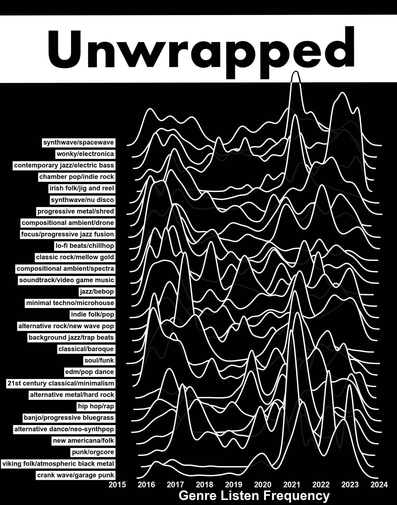
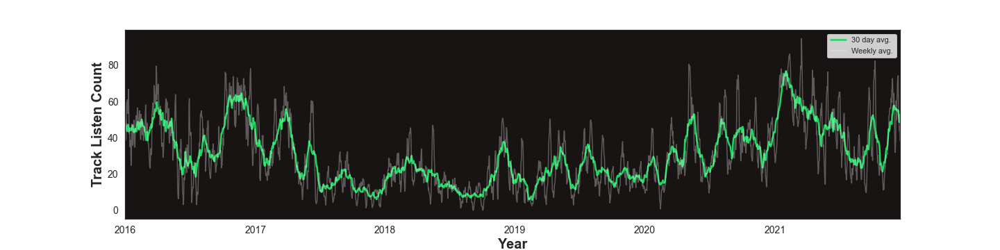
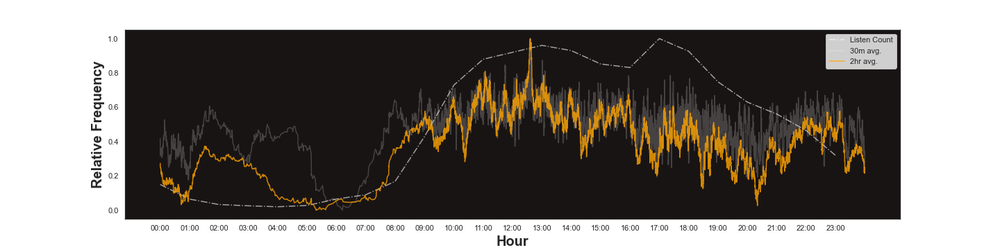
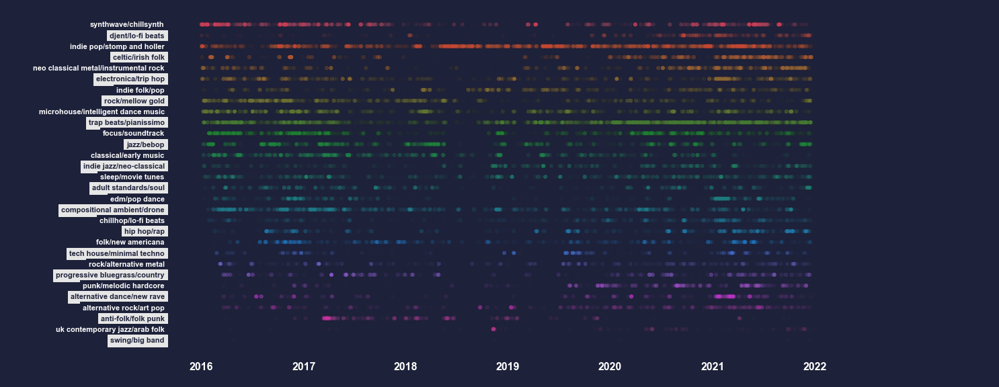
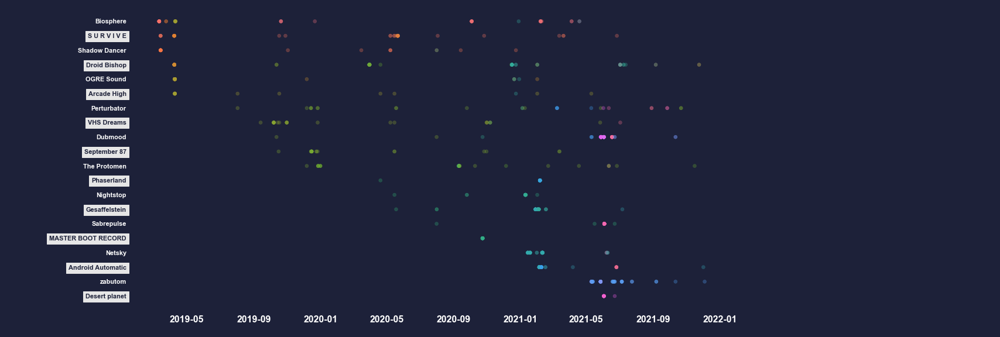

# Spotify Unwrapped

Spotify summarize individual users listening histories at the end of each year with [spotify-wrapped](https://engineering.atspotify.com/2020/02/18/spotify-unwrapped-how-we-brought-you-a-decade-of-data/).

By requesting personal streaming data and connecting with the Spotify web API, we can unwrap our listening history.




# Data
Extended streaming history arrives in the form:
<table border="1" class="dataframe">  <thead>    <tr style="text-align: right;">      <th>track_id</th>      <th>endTime</th>      <th>ms_played</th>      <th>conn_country</th>      <th>trackName</th>      <th>artistName</th>      <th>albumName</th>      <th>spotify_track_uri</th>      <th>reason_start</th>      <th>reason_end</th>      <th>shuffle</th>      <th>skipped</th>    </tr>  </thead>  <tbody>    <tr>       <td>19Oy2pBYfpz7OhraQQgUn8</td>      <td>2015-12-31 23:44:26</td>      <td>148285</td>      <td>GB</td>      <td>Negotiation's Over</td>      <td>OGRE Sound</td>      <td>195</td>      <td>spotify:track:19Oy2pBYfpz7OhraQQgUn8</td>      <td>clickrow</td>      <td>trackdone</td>      <td>False</td>      <td>0.0</td>    </tr>  </tbody></table>

The raw data may be partitioned e.g.
```
|-data
|  |-my_spotify_data.zip
|  |-MyData
|  |  |-2021_3.json
|  |  |-2023.json
|  |  |-2023_5.json
|  |  |-2016_0.json
|  |  |-2018_1.json
|  |  |-Streaming_History_Audio_2023_6.json
|  |  |-2020_2.json
|  |  |-2022_4.json
```

Data that only contains the past year will not contain the `spotify_track_uri` which lets you request metadata easily. Instead, we can use the search API to search for the artist, track record and assume the first result is correct.

From the artist names we can request the set of *genre tags* associated with that artist.

## Listening History
Over entire spotify account lifetime:


Aggregated to 24 hours (for year of 2021):


## Genre Clustering
Genre information associated with each artist is very granular (~5000 unique genres) so it becomes difficult to represent
genre listening history in a single plot. If we can aggregate related genres, we can view the entire history from the 
perspective of several high level genre clusters.

By treating genre lists as sentences we can:
  - build a **Genre2Vec** model, using Gensims Word2Vec
  - kmeans cluster on the resultant embedding space 
  - reduce the space to 2/3D with TSNE for visualisation

#### TSNE of genre2vec model
Each point represents a genre (several are directly named). Colour determined by kmeans clusters, transparency by personal listen count:


#### In 3D


#### Genre cluster listening activity spectral plot
The resulting 30 clusters are named automatically by their most frequent 2 genres (as per personal listening history).
We can view the genre "spectra" by plotting each listen over time and use transparency to highlight the intensity of occurance.


Or looking at the top 20 artists in a given genre cluster (coloured by track name).



# How to use
- [Request streaming history](https://support.spotify.com/us/article/data-rights-and-privacy-settings/) (full or for the past year)
- Install in a fresh environment:
    ```
    git clone https://github.com/Conchobhar/spotify-unwrapped.git
    pip install spotify-unwrapped
    ```
- Generate credentials by creating a web app: https://developer.spotify.com/dashboard/applications
- Place credentials in `credentials/client_credentials.json` (you can use the json template provided in directory)
- Once delivered, place `my_spotify_data.zip` in `data/`
- Run one or more tasks via `python -m spotify_unwrapped.get` to collect various metadata
  - `track_metadata` - Get info about tracks such as popularity
  - `track_metadata_from_search` - Get info about tracks such as popularity (from search API)
  - `artist_metadata_from_search` - Get info about artists such as the genres associated (from search API)
  - `audio_features` - Get info about tracks such as energy, tempo, dancibility. (No longer available, Spotify API deprecated as of Nov 2024)
- Run `notebooks/spotify-views.ipynb` and edit where necessary

**Note**: The full data request vs past year have slightly different column headers and the past year may contain less information, requiring API search requests.
