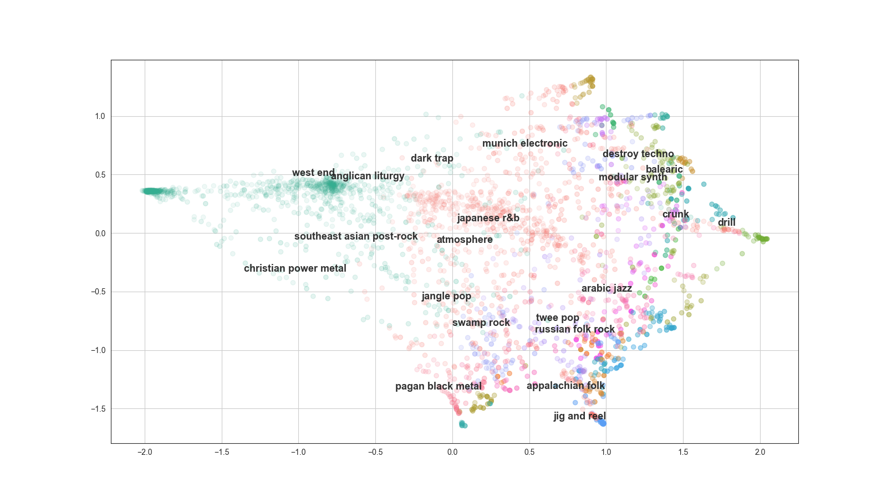

# Spotify Unwrapped
Detailed streaming history analytics and clustering

## Views
#### TSNE of genre word2vec model
Each point represents a genre (several are displayed). Colour determined by kmeans clusters, transparency by personal listen count:

#### In 3D

#### Genre cluster listening activity spectral plot

# Using the Spotify API
Generate credentials by creating a web app:

https://developer.spotify.com/dashboard/applications
